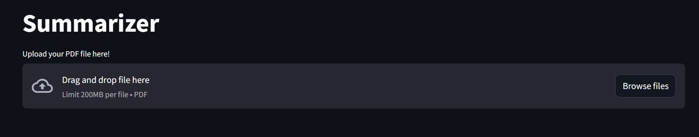
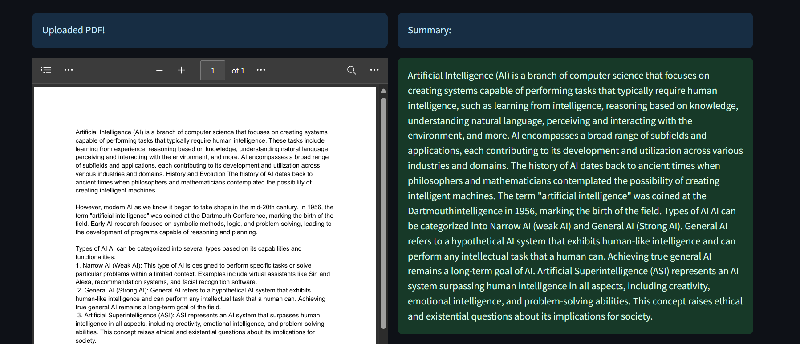

# Document-Summarizer

This project involves the creation of a Streamlit application designed to automate the summarization of documents using advanced AI models. The application integrates LangChain and employs a LaMini model sourced from Hugging Face to generate concise and accurate summaries of lengthy documents. It enhances the efficiency of information processing by providing users with quick and reliable summaries, aiding in better decision-making and information retention.

 LaMini-Flan-T5-248M:

This model is one of LaMini-LM model series in paper "LaMini-LM: A Diverse Herd of Distilled Models from Large-Scale Instructions". This model is a fine-tuned version of google/flan-t5-base on LaMini-instruction dataset that contains 2.58M samples for instruction fine-tuning. LaMini-Flan-T5-248M is a lightweight, fine-tuned variant of the T5 model with 248 million parameters. It is designed to perform a variety of NLP tasks efficiently by treating each task as a text-to-text problem. This specific model variant likely balances performance and resource efficiency, making it suitable for applications where computational resources are limited or where faster processing is needed.

for more details on the model, visit: ``` https://huggingface.co/MBZUAI/LaMini-Flan-T5-248M ``` 
or 
```https://github.com/mbzuai-nlp/lamini-lm/```

## Table of Contents

- [Features](#features)
- [Installation](#installation)
- [Environment](#environment)
- [Usage](#usage)
- [Contributing](#contributing)
- [Contact](#contact)

## Features

- **Streamlit Interface:** User-friendly interface for easy interaction and document upload.
- **Lamini Model:** Utilizes a state-of-the-art Lamini model for high-quality summaries.
- **LangChain Integration:** Seamless integration with LangChain to streamline model operations.
- **Hugging Face:** Incorporates models from Hugging Face, ensuring access to cutting-edge NLP technology.
  


## Installation

To install Document-Summarizer, follow these steps:

1. Clone the repository:
   ```sh
   git@github.com:Yadunandanv08/Document-Summarizer.git
   ```
2. Navigate to the project directory:
  ```sh
  cd Document-Summarizer
```
3. Install the required dependencies:
  ```sh
  pip install -r requirements.txt
```
 ### LaMini model
 
 The code used here is:

  Make sure you have git-lfs installed (https://git-lfs.com)
   ```sh
 git lfs install
   ```
# To use the LaMini model:
Clone the model repository
 ```sh
 git clone https://huggingface.co/MBZUAI/LaMini-Flan-T5-248M
   ```
If you want to clone without large files - just their pointers
 ```sh
GIT_LFS_SKIP_SMUDGE=1 git clone https://huggingface.co/MBZUAI/LaMini-Flan-T5-248M
   ```

## Environment
   The recommended specifications are:

Operating System: Windows 10 or above
Python Version: 3.8 or above
Required Packages: Listed in requirements.txt
Hardware Requirements:
Processor: Intel i5 or equivalent
RAM: 8GB or more
Storage: 2GB of free space

## Usage
To run the Document Summarizer, use the following command:

```sh
streamlit run app.py
```

 It is adviced to have a virtual environment folder  ``` .venv ``` 
 It is also adviced to have an "offload" folder to help with the model weights offloading to your disk.



## Contributing
Contributions and suggestions are welcome! To contribute, follow these steps:

Fork the repository.

Create a new branch (git checkout -b feature-branch).

Make your changes and commit them (git commit -m 'Add new feature').

Push to the branch (git push origin feature-branch).

Create a new Pull Request.

Please ensure your code follows our code of conduct and contribution guidelines.

## Contact
If you have any questions or suggestions, feel free to reach out at:

Email - yadunandanv08@gmail.com

Linkedin - https://www.linkedin.com/in/yadunandan-v-840255259/
        

   

